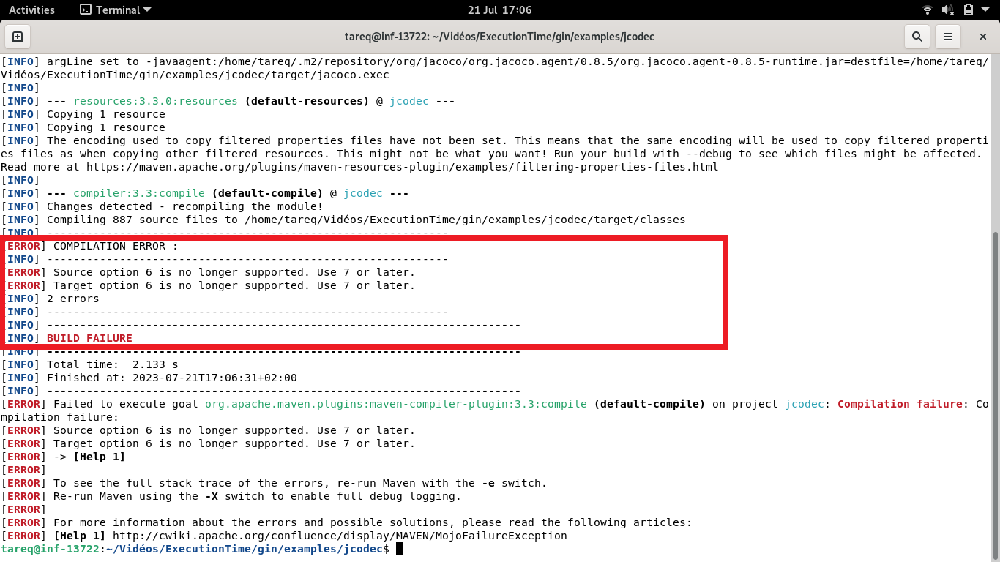
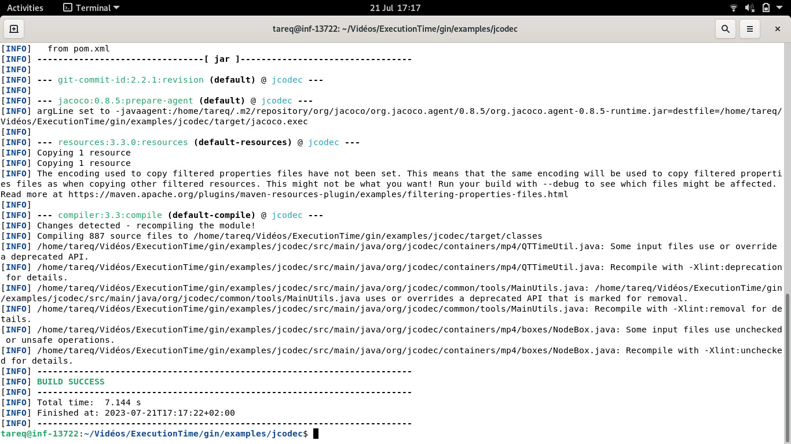
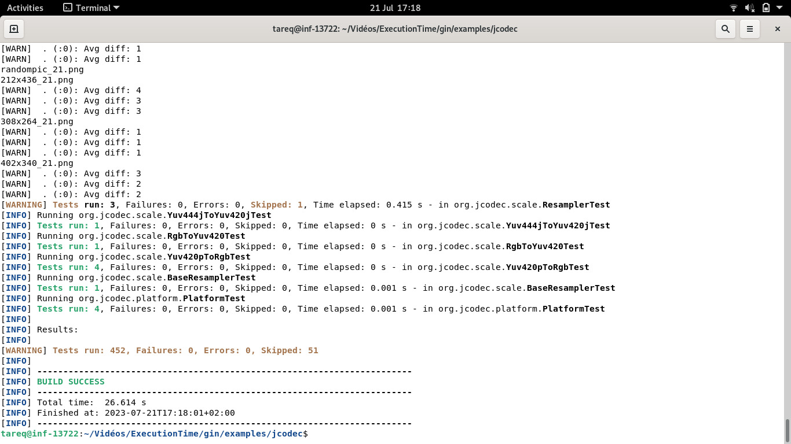
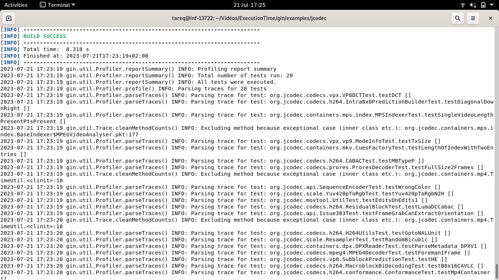
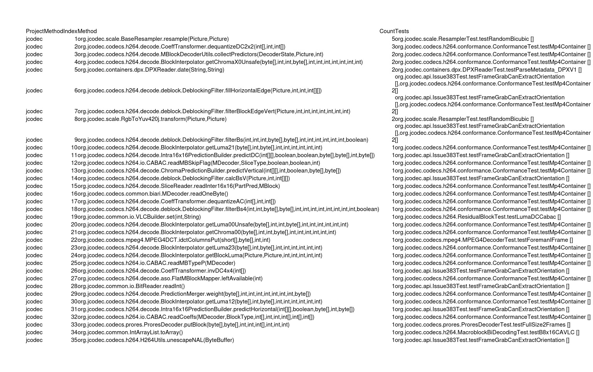
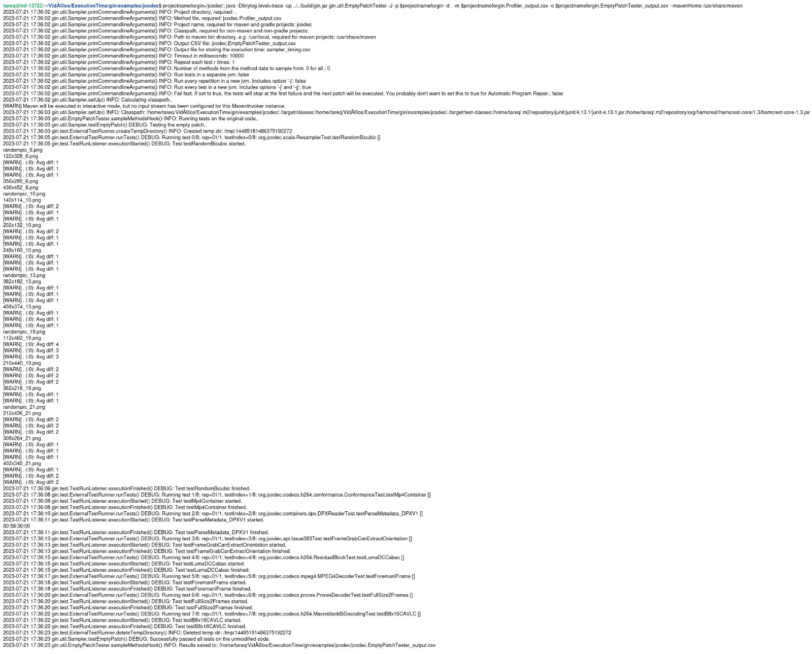
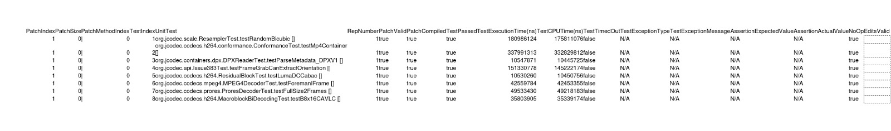
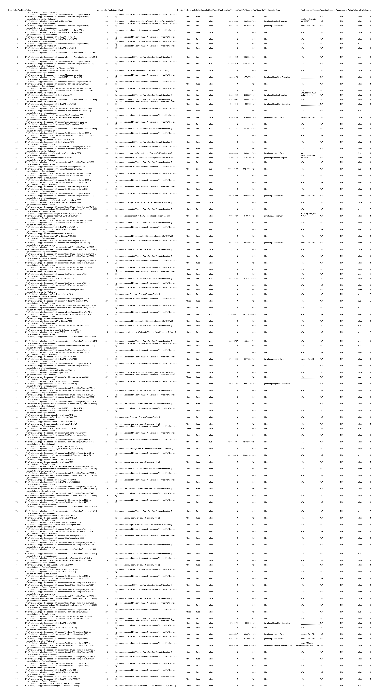

# Full Example with a Maven Project

As I was trying to execute the Full Maven Project 'Spartial4j' before, I faced some problems. I also explained what I experienced in the documentation.
**Links:**
- [Link to IDE experiment for Spartial4j project Documentation](https://github.com/TareqChy1/Internship_Work_Reports/tree/main/Full_Maven_Project_experiment_with_IDE)
- [Link to Command Line Experiment for Spartial4j project Documentation](https://github.com/TareqChy1/Internship_Work_Reports/blob/main/Comman_line_experiment(Full_Maven_Project)/Comman_line_experiment(Full_Maven_Project).md)

The main issue was that the spartial4j project is intended to run with Java 8. So, if we want to use this project, we need to use Gin version 2.1 (check out tag v2.1). There is another project which will be substituting spatial4j with jCodec [https://github.com/jcodec/jcodec]. It has been tested and works under Java 17.

I tried cloning, profiling, and sampling for mentioned project jCodec [https://github.com/jcodec/jcodec]. Below, I provided the steps I followed 

### Step 1:
First, move into the examples directory for cloning and clone the project:

```
cd examples
git clone https://github.com/jcodec/jcodec.git
cd jcodec 
```
Build with Maven to ensure we have all the dependencies we need, that the original Java source has compiled, and that all the tests run:

```
mvn compile
mvn test
```

When I was trying to execute the `mvn compile` command, I faced an error. I have provided the screenshot of the error below:

<p align="center">
    
</p>

Then I updated the pom.xml of this example to make this example compatible with Java 17.

Below I provided the modification I did in pom.xml file of the project:

```
<plugin>
        <groupId>org.apache.maven.plugins</groupId>
        <artifactId>maven-compiler-plugin</artifactId>
        <version>3.3</version>
        <configuration>
            <encoding>UTF-8</encoding>
            <source>1.7</source>
            <target>1.7</target>
        </configuration>
</plugin>
```

After that, I tried to execute the command `mvn compile`, and that time it was successfully executed.

<p align="center">
    
</p>

Then I executed the `mvn test` and it was successfully executed.

<p align="center">
    
</p>


### Step 2:

I tried to execute the first command regarding Gin profiler. In this case here limit to the first 20 tests for speed using -n 20. Results are written to a CSV. This CSV is used to specify the target methods and unit tests for the samplers below.

```
projectnameforgin='jcodec'; java -Dtinylog.level=trace -cp ../../build/gin.jar gin.util.Profiler -r 1 -mavenHome /usr/share/maven -n 20 -p $projectnameforgin -d . -o $projectnameforgin.Profiler_output.csv
```

The command ran successfully and stored the data in the CSV file. In the file, we have the targeted method. Below, I am providing a screenshot of the CSV file.

<p align="center">
    
</p>

Screenshots of the jcodec.Profiler_output.csv file:

<p align="center">
    
</p>

### Step 3:

Then I tried to run the EmptyPatchTester copmmand. This serves as a baseline, showing the performance of the original unaltered code against the unit tests.

```
projectnameforgin='jcodec'; java -Dtinylog.level=trace -cp ../../build/gin.jar gin.util.EmptyPatchTester -J -p $projectnameforgin -d . -m $projectnameforgin.Profiler_output.csv -o $projectnameforgin.EmptyPatchTester_output.csv  -mavenHome /usr/share/maven
```
The command ran successfully and stored the data in the CSV file. Below, I am providing a screenshot of the CSV file.

<p align="center">
    
</p>

Screenshots of the jcodec.EmptyPatchTester_output.csv:

<p align="center">
    
</p>

### Step 4:
Finally, I tried to run the RandomSampler to test the effect of different edits in the space. Here, we limit to statement edits; we allow only 1
edit per patch; and we test 100 edits sampled at random.

```
projectnameforgin='jcodec'; editType='STATEMENT'; patchSize='1'; patchNumber='100'; java -Dtinylog.level=trace -cp ../../build/gin.jar gin.util.RandomSampler -j -p $projectnameforgin -d . -m $projectnameforgin.Profiler_output.csv -o $projectnameforgin.RandomSampler_${editType}_patchSize${patchSize}_patchNumber${patchNumber}_output.csv -mavenHome /usr/share/maven -editType $editType -patchNumber $patchNumber -patchSize $patchSize
```

Screenshots of the jcodec.RandomSampler_STATEMENT_patchSize1_patchNumber100_output.csv :

<p align="center">
    
</p>


The main purpose of the given command is to run a Java-based tool called "RandomSampler" on a project named "jcodec." The tool aims to perform 100 random edits on the statements within the code of the "jcodec" project. The command specifies various parameters such as the edit type (limited to statement edits), the patch size (allowing only one edit per patch), and the output format (JSON mode). Additionally, the command sets paths to the project directory, a profiling output file, and the Maven installation directory. The "RandomSampler" tool likely aims to analyze the impact of random statement edits on the project's codebase, providing insights into potential improvements, bug detection, or code quality assessment. The resulting output will be stored in a CSV file named `jcodec.RandomSampler_STATEMENT_patchSize1_patchNumber100_output.csv` , and the trace-level logging ensures detailed information is captured during the execution of the tool.


