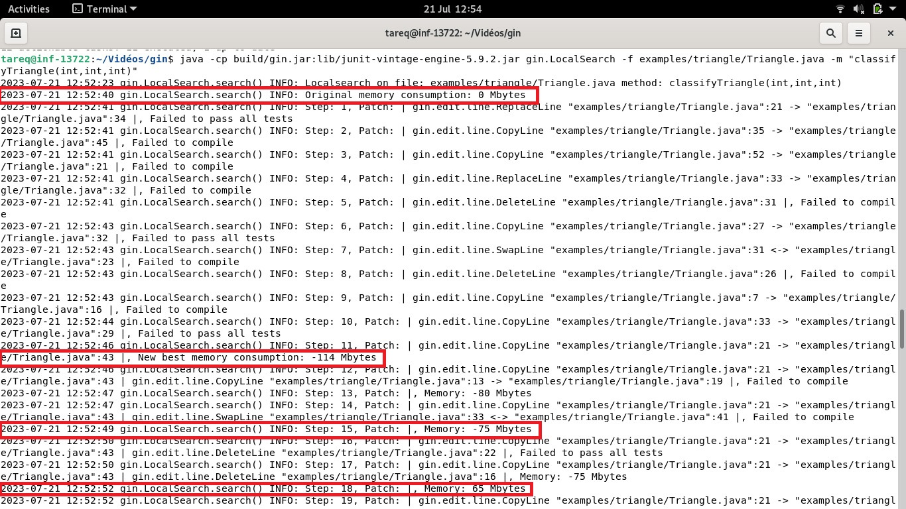
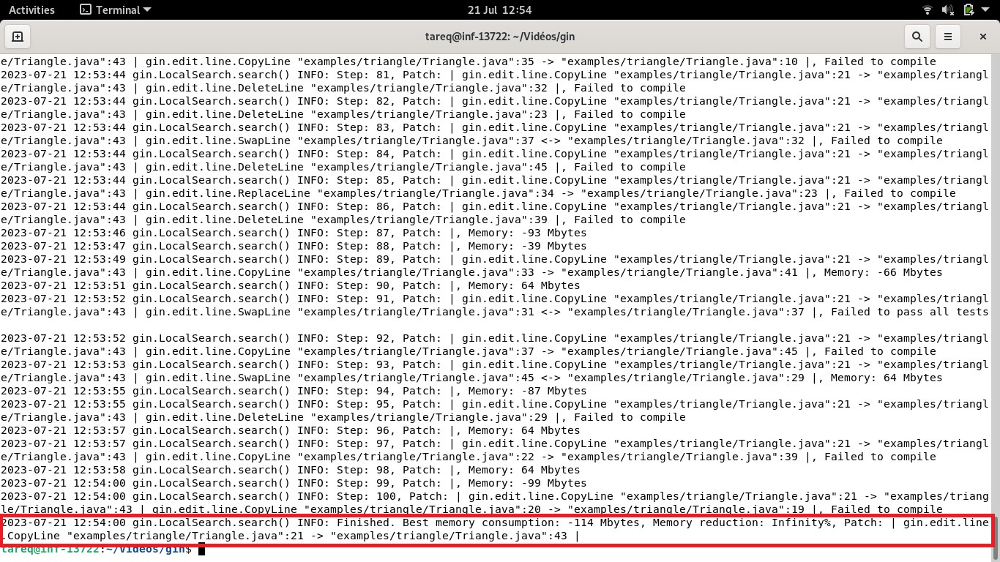
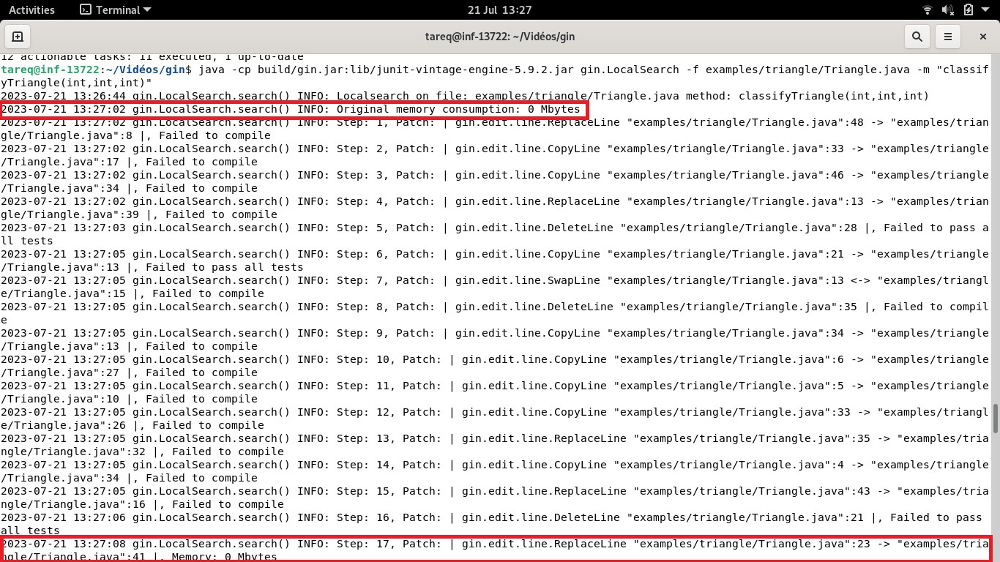
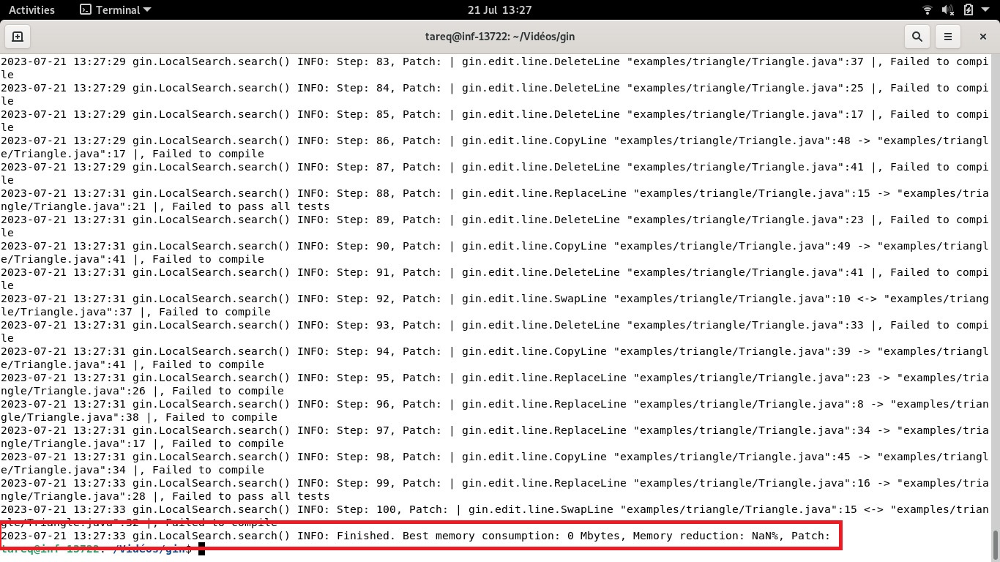
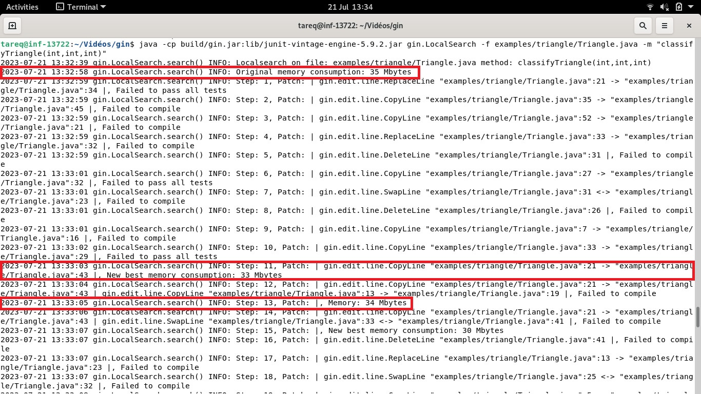
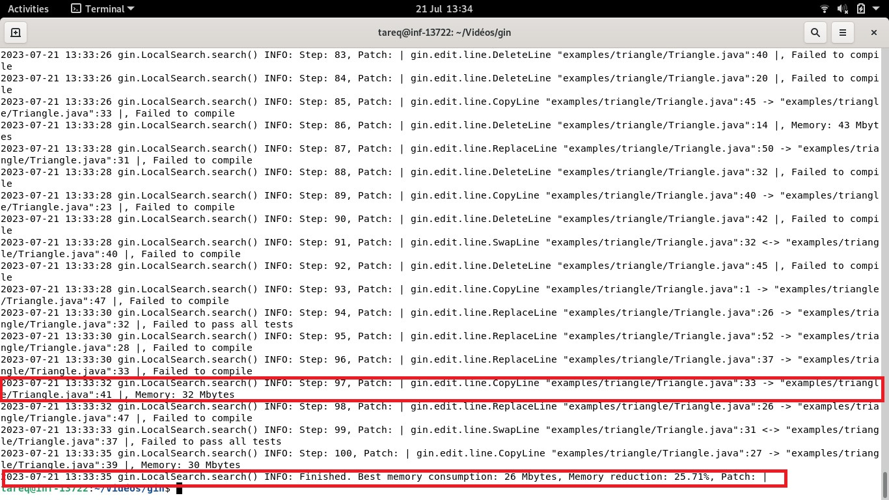

In the Gin toot repository's README, one section is mentioned as 'Running a Simple Example,' where we are able to get an optimized method with less execution time. However, the readme does not mention anything regarding memory consumption. In my experiment, memory consumption is also checked when we work on a multi-criteria fitness function (Memory Consumption and Execution Time). So, I was trying to find out the method with the least memory consumption for optimization. To achieve this, I made some modifications to the gin tool, which I will mention in the following steps.

### Step 1:

In the below provided command is used to execute a Java program that applies a local search algorithm from the gin.jar library and utilizes the JUnit 5 vintage engine from junit-vintage-engine-5.9.2.jar. The program operates on the Triangle.java file, located in the examples/triangle directory, which likely contains code related to a triangle classification task. The specific method classifyTriangle(int,int,int) within the Triangle.java file is targeted for execution, implying that it is responsible for classifying triangles based on their side lengths.
```
java -cp build/gin.jar:lib/junit-vintage-engine-5.9.2.jar gin.LocalSearch -f examples/triangle/Triangle.java -m "classifyTriangle(int,int,int)"
```
This command allows the user to run the local search algorithm on the specified triangle classification method, providing a means to optimize and improve the triangle classification process. For this reason I reviewed the `LocalSearch.java` class in  `gin.LocalSearch`. Then I did modification in the code for getting memory consumption. 

The modification made to the `LocalSearch` class to measure memory consumption, the changes mainly revolve around adding functionality to calculate and log memory usage during the local search process. Here is a summary of the modifications:

i. `memoryOriginalCode()` Method: This method is added to the class to evaluate the memory consumption of the original code (i.e., the code without any patches). It creates an empty patch, runs the test cases on the original code, and calculates the memory usage from the test results.

ii. Logging Memory Consumption: The code is modified to log memory consumption instead of execution time. The `Logger` class from the `tinylog` library is used to output information about memory usage. The log messages report the memory consumption of the original code and the memory consumption of each step of the local search process.

iii. `totalMemoryUsage()` Method: The `UnitTestResultSet` class contains a new method named `totalMemoryUsage()` that calculates the total memory used by the test cases. This method is utilized to get the memory consumption for each patch during the local search.

iv. Variables and Messages: The variable names and log messages are adjusted to reflect memory consumption instead of execution time. For example, instead of "Original execution time," it's now "Original memory consumption," and similarly, "New best time" becomes "New best memory consumption."

v. Memory Reduction Calculation: A calculation is introduced to determine the percentage reduction in memory consumption achieved by the best patch compared to the original code.

In summary, the modification enables the `LocalSearch` class to evaluate and report memory consumption during the local search process for optimizing code with patches. This allows developers to analyze the memory efficiency of the program and identify patches that lead to memory improvements.

### Here is the code for the `LocalSearch.java` class for Memory Consumption:

```
package gin;

import com.sampullara.cli.Args;
import com.sampullara.cli.Argument;
import gin.edit.Edit;
import gin.edit.Edit.EditType;
import gin.test.InternalTestRunner;
import gin.test.UnitTestResult;
import gin.test.UnitTestResultSet;
import org.apache.commons.io.FilenameUtils;
import org.apache.commons.rng.simple.JDKRandomBridge;
import org.apache.commons.rng.simple.RandomSource;
import org.pmw.tinylog.Logger;

import java.io.File;
import java.io.Serial;
import java.io.Serializable;
import java.util.Collections;
import java.util.List;
import java.util.Random;

/**
 * Simple local search. Takes a source filename and a method signature, optimizes it.
 * Assumes the existence of accompanying Test Class.
 * The class must be in the top level package if classPath not provided.
 */
public class LocalSearch implements Serializable {

    @Serial
    private static final long serialVersionUID = -92020344633720482L;

    private static final int WARMUP_REPS = 10;

    @Argument(alias = "f", description = "Required: Source filename", required = true)
    protected File filename = null;

    @Argument(alias = "m", description = "Required: Method signature including arguments." +
            "For example, \"classifyTriangle(int,int,int)\"", required = true)
    protected String methodSignature = "";

    @Argument(alias = "s", description = "Seed")
    protected Integer seed = 123;

    @Argument(alias = "n", description = "Number of steps")
    protected Integer numSteps = 100;

    @Argument(alias = "d", description = "Top directory")
    protected File packageDir;

    @Argument(alias = "c", description = "Class name")
    protected String className;

    @Argument(alias = "cp", description = "Classpath")
    protected String classPath;

    @Argument(alias = "t", description = "Test class name")
    protected String testClassName;

    @Argument(alias = "et", description = "Edit type: this can be a member of the EditType enum (LINE,STATEMENT,MATCHED_STATEMENT,MODIFY_STATEMENT); the fully qualified name of a class that extends gin.edit.Edit, or a comma-separated list of both")
    protected String editType = EditType.LINE.toString();

    /**
     * allowed edit types for sampling: parsed from editType
     */
    protected List<Class<? extends Edit>> editTypes;

    @Argument(alias = "ff", description = "Fail fast. "
            + "If set to true, the tests will stop at the first failure and the next patch will be executed. "
            + "You probably don't want to set this to true for Automatic Program Repair.")
    protected Boolean failFast = false;

    protected SourceFile sourceFile;
    protected Random rng;
    InternalTestRunner testRunner;

    // Constructor parses arguments
    LocalSearch(String[] args) {
        Args.parseOrExit(this, args);
        editTypes = Edit.parseEditClassesFromString(editType);

        this.sourceFile = SourceFile.makeSourceFileForEditTypes(editTypes, this.filename.toString(), Collections.singletonList(this.methodSignature));

        this.rng = new JDKRandomBridge(RandomSource.MT, Long.valueOf(seed));
        if (this.packageDir == null) {
            this.packageDir = (this.filename.getParentFile() != null) ? this.filename.getParentFile().getAbsoluteFile() : new File(System.getProperty("user.dir"));
        }
        if (this.classPath == null) {
            this.classPath = this.packageDir.getAbsolutePath();
        }
        if (this.className == null) {
            this.className = FilenameUtils.removeExtension(this.filename.getName());
        }
        if (this.testClassName == null) {
            this.testClassName = this.className + "Test";
        }
        this.testRunner = new InternalTestRunner(className, classPath, testClassName, failFast);
    }

    // Instantiate a class and call search
    public static void main(String[] args) {
        LocalSearch simpleLocalSearch = new LocalSearch(args);
        simpleLocalSearch.search();
    }

    // Apply empty patch and return memory consumption
    private long memoryOriginalCode() {
        Patch emptyPatch = new Patch(this.sourceFile);
        UnitTestResultSet resultSet = testRunner.runTests(emptyPatch, WARMUP_REPS);

        if (!resultSet.allTestsSuccessful()) {
            if (!resultSet.getCleanCompile()) {
                Logger.error("Original code failed to compile");
            } else {
                Logger.error("Original code failed to pass unit tests");
                for (UnitTestResult testResult : resultSet.getResults()) {
                    Logger.error(testResult);
                }
            }
            System.exit(0);
        }

        return resultSet.totalMemoryUsage() / WARMUP_REPS;
    }

    // Simple local search
    private void search() {
        Logger.info(String.format("Localsearch on file: %s method: %s", filename, methodSignature));

        // Memory consumption of original code
        long origMemory = memoryOriginalCode();
        Logger.info("Original memory consumption: " + origMemory + " Mbytes");

        // Start with empty patch
        Patch bestPatch = new Patch(this.sourceFile);
        long bestMemory = origMemory;

        for (int step = 1; step <= numSteps; step++) {
            Patch neighbour = neighbour(bestPatch);
            UnitTestResultSet testResultSet = testRunner.runTests(neighbour, 1);

            String msg;

            if (!testResultSet.getValidPatch()) {
                msg = "Patch invalid";
            } else if (!testResultSet.getCleanCompile()) {
                msg = "Failed to compile";
            } else if (!testResultSet.allTestsSuccessful()) {
                msg = "Failed to pass all tests";
            } else if (testResultSet.totalMemoryUsage() >= bestMemory) {
                msg = "Memory: " + testResultSet.totalMemoryUsage() + " Mbytes";
            } else {
                bestPatch = neighbour;
                bestMemory = testResultSet.totalMemoryUsage();
                msg = "New best memory consumption: " + bestMemory + " Mbytes ";
            }

            Logger.info(String.format("Step: %d, Patch: %s, %s ", step, neighbour, msg));
        }

        Logger.info(String.format("Finished. Best memory consumption: %d Mbytes, Memory reduction: %.2f%%, Patch: %s",
                bestMemory,
                100.0 * ((origMemory - bestMemory) / (1.0 * origMemory)),
                bestPatch));

        bestPatch.writePatchedSourceToFile(sourceFile.getRelativePathToWorkingDir() + ".optimised");
    }

    /**
     * Generate a neighboring patch, either by deleting an edit or adding a new one.
     *
     * @param patch Generate a neighbor of this patch.
     * @return A neighboring patch.
     */
    Patch neighbour(Patch patch) {
        Patch neighbour = patch.clone();

        if (neighbour.size() > 0 && rng.nextFloat() > 0.5) {
            neighbour.remove(rng.nextInt(neighbour.size()));
        } else {
            neighbour.addRandomEditOfClasses(rng, editTypes);
        }

        return neighbour;
    }
}

```

### Step 2:

After modification of the LocalSearch.java class, I built the gin tool using gradle by executing the following command:

```
./gradlew clean build -x test copyToLib
```
Then I tried to execute the command provided below:

```
java -cp build/gin.jar:lib/junit-vintage-engine-5.9.2.jar gin.LocalSearch -f examples/triangle/Triangle.java -m "classifyTriangle(int,int,int)"
```

As a result, in the command line, it was providing me with an original memory consumption of zero (0 Mbytes), and after applying some patches, it was giving me negative values. Below, I have provided screenshots of the command line output.

<p align="center">
    
</p>

<p align="center">
    
</p>

### Step 3:
Then I did debugging to understand what the code is doing. I found that memory calculations were performed in `gin.test.TestRunListener` class (`TestRunListener.java`). Memory optimization was offered by `GPMemory.java`, which can be found at `https://github.com/gintool/gin/blob/v2.1/src/main/java/gin/util/GPMemory.java`. The `util` folder contains various methods for searching and profiling software.

### Step 4:

#### Issue: 
I found one issues in the Memory calculations class `TestRunListener.java`. The issue is that the garbage collector might have run between the start and end of the test to free up memory. This would cause the end memory usage to be lower than the start memory usage. So it will result in negative value.

#### Solution:
We can force the garbage collector to run before the execution by using System.gc(), which makes the result accurate.

Here, I have provided the updated code of the `TestRunListener.java`.

```
package gin.test;

import org.junit.platform.engine.TestExecutionResult;
import org.junit.platform.launcher.TestExecutionListener;
import org.junit.platform.launcher.TestIdentifier;
import org.junit.runner.Description;
import org.junit.runner.notification.Failure;
import org.pmw.tinylog.Logger;

import java.io.Serial;
import java.io.Serializable;
import java.lang.management.ManagementFactory;
import java.lang.management.ThreadMXBean;
import java.util.concurrent.TimeoutException;

/**
 * Saves result of a UnitTest run into UnitTestResult.
 * assumes one test case is run through JUnitCore at a time
 * ignored tests and tests with assumption violations are considered successful (following JUnit standard)
 */
public class TestRunListener implements Serializable, TestExecutionListener {

    @Serial
    private static final long serialVersionUID = -1768323084872818847L;
    private static final long MB = 1024 * 1024;
    private static final ThreadMXBean threadMXBean = ManagementFactory.getThreadMXBean();
    private final UnitTestResult unitTestResult;
    private long startTime = 0;
    private long startCPUTime = 0;
    private long startMemoryUsage = 0;

    public TestRunListener(UnitTestResult unitTestResult) {
        this.unitTestResult = unitTestResult;
    }


    public void executionFinished(TestIdentifier testIdentifier, TestExecutionResult testExecutionResult) {
        if (testIdentifier.isTest()) {
            Logger.debug("Test " + testIdentifier.getDisplayName() + " finished.");
            long endTime = System.nanoTime();
            long endCPUTime = threadMXBean.getCurrentThreadCpuTime();
            Runtime runtime = Runtime.getRuntime();
            long endMemoryUsage = (runtime.totalMemory() - runtime.freeMemory()) / MB;
            unitTestResult.setExecutionTime(endTime - startTime);
            unitTestResult.setCPUTime(endCPUTime - startCPUTime);
            unitTestResult.setMemoryUsage(endMemoryUsage - startMemoryUsage);
            Throwable throwable = testExecutionResult.getThrowable().orElse(new RuntimeException("Unknown Exception."));
            switch (testExecutionResult.getStatus()) {
                case FAILED:
                    unitTestResult.setPassed(false);
                    unitTestResult.addFailure(new Failure(Description.createTestDescription("", "", testIdentifier.getUniqueId()),
                            throwable));
                    unitTestResult.setTimedOut(throwable instanceof TimeoutException);
                    break;
                case ABORTED:
                    unitTestResult.addFailure(new Failure(Description.createTestDescription("", "", testIdentifier.getUniqueId()),
                            throwable));
                case SUCCESSFUL:
                    unitTestResult.setPassed(true);
                    break;
            }
        }
    }

    public void executionSkipped(TestIdentifier testIdentifier, String reason) {
        if (testIdentifier.isTest()) {
            Logger.debug("Test " + testIdentifier.getDisplayName() + " skipped due to " + reason);
            unitTestResult.setPassed(true);
        }
    }

    public void executionStarted(TestIdentifier testIdentifier) {
        if (testIdentifier.isTest()) {
            Logger.debug("Test " + testIdentifier.getDisplayName() + " started.");
            this.startTime = System.nanoTime();
            this.startCPUTime = threadMXBean.getCurrentThreadCpuTime();
            System.gc();
            Runtime runtime = Runtime.getRuntime();
            this.startMemoryUsage = (runtime.totalMemory() - runtime.freeMemory()) / MB;
            
        }
    }

}

```

### Step 5:

After that I again build the gin tool and tried to run the following command:

```
./gradlew clean build -x test copyToLib
```

```
java -cp build/gin.jar:lib/junit-vintage-engine-5.9.2.jar gin.LocalSearch -f examples/triangle/Triangle.java -m "classifyTriangle(int,int,int)"
```

Here, I provided what I got as output in the command line:

<p align="center">
    
</p>

<p align="center">
    
</p>

Seeing this output, we can understand that the negative value of the memory consumption is solved, but the example code Triangle still provides original memory consumption of zero (0 Mbytes). It might be that the Triangle function is too quick, i.e., it falls in-between two samples, so the same memory is measured before and after the function, resulting in 0 (end-start measurement). There's also a rounding error to consider. For this reason, I instrumented the `classifyTriangle` function with more memory-intensive tasks. That means I modified the Triangle's `classifyTriangle` method to be more memory-consuming to observe the effect.

### Step 6:

Here is the modified Triangle Java class, which will consume more memory.

```
import java.util.Arrays;

public class Triangle {

    static final int INVALID = 0;
    static final int SCALENE = 1;
    static final int EQUALATERAL = 2;
    static final int ISOCELES = 3;

    public static int classifyTriangle(int a, int b, int c) {

        // Consume more memory by creating a large array
        int[] largeArray = new int[1000000];
        Arrays.fill(largeArray, 0);

        delay();

        // Sort the sides so that a <= b <= c
        if (a > b) {
            int tmp = a;
            a = b;
            b = tmp;
        }

        if (a > c) {
            int tmp = a;
            a = c;
            c = tmp;
        }

        if (b > c) {
            int tmp = b;
            b = c;
            c = tmp;
        }

        if (a + b <= c) {
            return INVALID;
        } else if (a == b && b == c) {
            return EQUALATERAL;
        } else if (a == b || b == c) {
            return ISOCELES;
        } else {
            return SCALENE;
        }

    }

    private static void delay() {
        try {
            Thread.sleep(100);
        } catch (InterruptedException e) {

        }
    }

}
```

After that I again build the gin tool and tried to run the following command:

```
./gradlew clean build -x test copyToLib
```

```
java -cp build/gin.jar:lib/junit-vintage-engine-5.9.2.jar gin.LocalSearch -f examples/triangle/Triangle.java -m "classifyTriangle(int,int,int)"
```

Here, I provided what I got as an output in the command line:

<p align="center">
    
</p>

<p align="center">
    
</p>

Finally, we are able to get the lowest memory consumption, an optimized Triangle Java program. 
- The original memory consumption:35 Mbytes.
- The best lowest memory consumption: 26 Mbytes.
- Memory reduction: 25.71%
